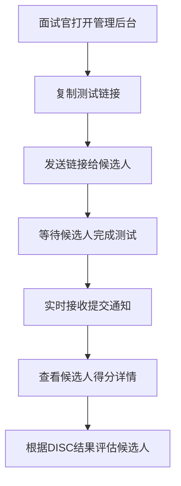
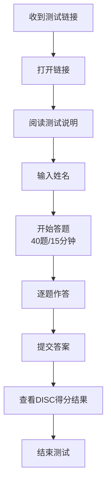

# DISC 性格测试系统 - 项目介绍文档

## 📋 项目概述

**DISC 性格测试系统** 是一个专业的在线性格评估工具，旨在帮助企业在招聘过程中科学、高效地评估候选人的性格特征。系统支持面试官远程发送测试链接，候选人通过手机或电脑完成测试后，面试官可在管理后台实时查看所有测试结果。

### 核心价值
- **科学评估**：基于国际公认的 DISC 性格理论
- **远程便捷**：候选人可随时随地完成测试
- **实时反馈**：面试官可实时查看测试结果
- **数据管理**：系统化管理所有候选人的测试数据

---

## 🎯 DISC 理论基础

DISC 理论是一种广泛应用的性格分类模型，将人的性格特征分为四大维度：

| 类型 | 英文 | 中文名称 | 核心特质 | 典型表现 |
|------|------|----------|----------|----------|
| **D** | Dominance | 支配型/掌控型 | 结果导向、果断 | 喜欢掌控、追求成就、直接坦率 |
| **I** | Influence | 影响型/社交型 | 人际导向、乐观 | 善于交际、充满活力、积极乐观 |
| **S** | Steadiness | 稳健型/支持型 | 稳定导向、耐心 | 善于倾听、团队合作、稳定可靠 |
| **C** | Conscientiousness | 谨慎型/服从型 | 质量导向、严谨 | 注重细节、分析力强、追求完美 |

### 测试原理
- **题目数量**：40 道标准化测试题
- **答题方式**：每题 4 个选项，选择最符合自己的描述
- **计分方式**：每个选项对应 D/I/S/C 四个维度的分值
- **结果呈现**：计算四个维度的总分，生成性格剖面图

---

## ✨ 功能特性

### 1. 候选人测试端 (`/`)

#### 测试流程


#### 功能亮点
- **友好的用户界面**：清晰的步骤引导，简洁现代的设计
- **限时答题**：15 分钟倒计时，培养候选人的答题节奏
- **实时进度**：显示当前题号和完成进度
- **防刷机制**：提交后 5 分钟冷却期，防止重复提交
- **即时反馈**：提交后立即可查看 DISC 得分和性格类型分析

### 2. 面试官管理端 (`/admin`)

#### 核心功能
- **提交记录列表**：查看所有候选人的测试提交记录
- **搜索筛选**：按候选人姓名进行模糊搜索
- **详细分析**：点击查看每个候选人的详细得分和答题情况
- **实时推送**：使用 Supabase Realtime 实现新提交实时通知
- **数据可视化**：雷达图/柱状图展示 DISC 得分分布

#### 界面预览功能
- 候选人姓名和提交时间
- D/I/S/C 各维度得分
- 主导性格类型判断
- 答题用时统计

---

## 🛠 技术架构

### 技术栈

#### 前端技术
| 技术 | 版本 | 用途 |
|------|------|------|
| React | 18.3.1 | UI 组件库 |
| TypeScript | ~5.6.2 | 类型安全 |
| Vite | 5.4.10 | 构建工具 |
| Tailwind CSS | 3.4.17 | 样式框架 |
| React Router DOM | 7.14.1 | 路由管理 |
| Recharts | 3.8.1 | 数据可视化 |
| Lucide React | 1.8.0 | 图标库 |
| tailwind-merge | 3.5.0 | 样式合并 |

#### 后端服务
| 技术 | 用途 |
|------|------|
| Supabase | Backend-as-a-Service |
| PostgreSQL | 数据存储 |
| Supabase Realtime | 实时数据推送 |
| Supabase JS SDK | 前端数据交互 |

#### 部署平台
- **EdgeOne Pages**：静态资源部署和 CDN 加速

### 项目结构

```
disc-test-system/
├── src/
│   ├── assets/              # 静态资源
│   ├── components/          # React 组件
│   │   ├── CooldownScreen.tsx      # 冷却期页面
│   │   ├── NameInputScreen.tsx     # 姓名输入页面
│   │   ├── ResultScreen.tsx       # 结果展示页面
│   │   ├── SearchBar.tsx          # 搜索栏组件
│   │   ├── SubmissionDetail.tsx   # 提交详情组件
│   │   ├── SubmissionList.tsx     # 提交列表组件
│   │   ├── TestingScreen.tsx      # 测试答题页面
│   │   └── WelcomeScreen.tsx     # 欢迎页面
│   ├── data/
│   │   └── questions.ts    # 40道DISC测试题目
│   ├── hooks/              # 自定义 React Hooks
│   ├── lib/
│   │   └── supabase.ts     # Supabase 客户端配置
│   ├── pages/
│   │   ├── AdminPage.tsx   # 管理后台页面
│   │   └── TestPage.tsx    # 测试页面
│   ├── types/
│   │   └── index.ts        # TypeScript 类型定义
│   ├── utils/              # 工具函数
│   ├── App.tsx             # 根组件
│   ├── main.tsx            # 入口文件
│   └── index.css           # 全局样式
├── supabase/
│   └── schema.sql         # 数据库建表脚本
├── public/                # 公共资源目录
├── index.html             # HTML 模板
├── package.json           # 项目配置
├── tsconfig.json          # TypeScript 配置
├── vite.config.ts         # Vite 配置
├── tailwind.config.js     # Tailwind 配置
├── postcss.config.js      # PostCSS 配置
├── .env                  # 环境变量（本地）
├── .env.example          # 环境变量示例
└── README.md            # 项目说明文档
```

---

## 🚀 安装与部署

### 环境要求
- Node.js >= 18.0.0
- npm >= 9.0.0
- Supabase 账号

### 快速开始

#### 1. 克隆项目
```bash
git clone <repository-url>
cd disc-test-system
```

#### 2. 配置 Supabase 后端

**步骤 1：创建 Supabase 项目**
1. 访问 [Supabase 官网](https://supabase.com/) 注册并登录
2. 点击 "New Project" 创建新项目
3. 等待项目初始化完成（约 2 分钟）

**步骤 2：执行数据库脚本**
1. 进入项目 Dashboard → **SQL Editor**
2. 复制 `supabase/schema.sql` 中的全部内容
3. 粘贴到 SQL Editor 中并执行
4. 确认表 `test_submissions` 创建成功

**步骤 3：获取 API 密钥**
1. 进入 Dashboard → **Settings** → **API**
2. 复制 `Project URL`（格式：https://xxx.supabase.co）
3. 复制 `anon public key`（格式：eyJhbGciOiJIUzI1NiIsInR5cCI6IkpXVCJ9...）

#### 3. 配置环境变量

```bash
# 复制环境变量模板
cp .env.example .env
```

编辑 `.env` 文件，填入 Supabase 配置：
```env
VITE_SUPABASE_URL=https://your-project-id.supabase.co
VITE_SUPABASE_ANON_KEY=your-anon-key
```

#### 4. 安装依赖

```bash
npm install
```

#### 5. 启动开发服务器

```bash
npm run dev
```

访问 `http://localhost:5173` 查看项目。

### 构建生产版本

```bash
npm run build
```

构建产物位于 `dist/` 目录。

### 部署到 GitHub Pages

本项目已配置 **GitHub Actions 自动部署**，推送代码到 `main` 分支即可自动构建和部署。

#### 自动部署（推荐）

**前置条件**：
1. ✅ 项目已推送到 GitHub 仓库
2. ✅ 在仓库设置中启用 GitHub Pages

**启用步骤**：
1. 进入 GitHub 仓库 → **Settings** → **Pages**
2. 在 **Build and deployment** → **Source** 中选择 **GitHub Actions**
3. 推送代码到 `main` 分支，GitHub Actions 会自动执行部署

**部署流程**：


**GitHub Actions 配置**（`.github/workflows/deploy.yml`）：
- **触发条件**：推送到 `main` 分支或手动触发
- **构建任务**：
  - 检出代码（actions/checkout@v4）
  - 设置 Node.js 20（actions/setup-node@v4）
  - 安装依赖（npm ci）
  - 构建项目（npm run build）
  - 配置 Pages（actions/configure-pages@v5）
  - 上传构建产物（actions/upload-pages-artifact@v3）
- **部署任务**：
  - 部署到 GitHub Pages（actions/deploy-pages@v4）

**访问地址**：
```
https://<your-github-username>.github.io/disc-test-system/
```

**示例**：
- 如果 GitHub 用户名是 `sincecao`
- 访问地址为：`https://sincecao.github.io/disc-test-system/`
- 管理后台：`https://sincecao.github.io/disc-test-system/#/admin`

#### 手动部署

如果需要本地构建并手动部署到 `gh-pages` 分支：

```bash
# 安装 GitHub Pages 部署工具（可选）
npm install -D gh-pages

# 添加部署脚本到 package.json
# "deploy": "npm run build && gh-pages -d dist"

# 执行部署
npm run deploy
```

#### 环境变量配置

⚠️ **重要**：GitHub Pages 是纯静态托管，不支持服务器端环境变量。

**解决方案：在构建时嵌入环境变量**

项目使用 Vite 的 `import.meta.env` 来访问环境变量，构建时会将 `VITE_` 开头的变量嵌入到代码中。

**本地构建**：
1. 确保 `.env` 文件已配置 Supabase 凭证
2. 执行 `npm run build`
3. 构建后的 `dist/` 目录已包含嵌入的配置

**GitHub Actions 构建**：
有两种方式配置环境变量：

**方式 1：使用 GitHub Secrets（推荐）**
1. 进入 GitHub 仓库 → **Settings** → **Secrets and variables** → **Actions**
2. 添加 Repository secrets：
   - `VITE_SUPABASE_URL`
   - `VITE_SUPABASE_ANON_KEY`
3. 修改 `.github/workflows/deploy.yml`，在 build 步骤中添加环境变量：

```yaml
- name: Build
  run: npm run build
  env:
    VITE_SUPABASE_URL: ${{ secrets.VITE_SUPABASE_URL }}
    VITE_SUPABASE_ANON_KEY: ${{ secrets.VITE_SUPABASE_ANON_KEY }}
```

**方式 2：直接在代码中配置（当前采用）**
- 将 Supabase 配置直接写入 `.env` 文件
- ⚠️ 注意：`.env` 文件会被提交到 Git 仓库，不适合敏感信息
- ✅ 适合：公开项目或 Supabase 使用 `anon key`（本身就是公开的）

#### 重要配置说明

**1. Vite base 配置**
```typescript
// vite.config.ts
export default defineConfig({
  base: '/disc-test-system/',  // 必须设置为仓库名
  // ...
})
```
- GitHub Pages 访问路径包含仓库名作为子路径
- 如果设置为 `/`，部署到 `https://<username>.github.io/` 时才正确
- 如果仓库名是 `disc-test-system`，必须设置为 `/disc-test-system/`

**2. React Router 配置**
```typescript
// src/main.tsx
import { HashRouter } from 'react-router-dom'

<HashRouter>
  <App />
</HashRouter>
```
- ✅ 使用 `HashRouter` 而非 `BrowserRouter`
- 原因：GitHub Pages 不支持 SPA 的客户端路由（刷新页面会 404）
- `HashRouter` 使用 URL hash（`#/admin`）来避免这个问题

**3. 构建产物检查**
```bash
# 构建后检查 dist/ 目录
npm run build
ls -la dist/

# 检查 index.html 中的资源路径是否正确
# 应该看到：<script src="/disc-test-system/assets/..."></script>
```

**4. GitHub Pages 限制**
- ✅ 支持：静态 HTML/CSS/JS
- ❌ 不支持：服务器端渲染（SSR）
- ❌ 不支持：API 路由、服务器端环境变量
- ✅ 解决方案：使用 Supabase 作为后端（客户端直连数据库）

---

## 📊 数据库设计

### 表结构

#### test_submissions（测试提交表）

| 字段名 | 类型 | 约束 | 说明 |
|--------|------|------|------|
| id | UUID | PRIMARY KEY | 提交记录唯一标识 |
| candidate_name | TEXT | NOT NULL | 候选人姓名 |
| answers | JSONB | NOT NULL | 答题答案（格式：{1: 0, 2: 2, ...}） |
| score_d | INTEGER | NOT NULL DEFAULT 0 | D 维度得分 |
| score_i | INTEGER | NOT NULL DEFAULT 0 | I 维度得分 |
| score_s | INTEGER | NOT NULL DEFAULT 0 | S 维度得分 |
| score_c | INTEGER | NOT NULL DEFAULT 0 | C 维度得分 |
| duration_seconds | INTEGER | NULLABLE | 答题用时（秒） |
| created_at | TIMESTAMPTZ | DEFAULT NOW() | 提交时间 |

### 安全策略（RLS）

```sql
-- 允许任何人插入提交记录（候选人提交答案）
CREATE POLICY "Anyone can insert submissions" 
  ON test_submissions FOR INSERT TO anon WITH CHECK (true);

-- 允许任何人查询提交记录（管理后台查看）
CREATE POLICY "Anyone can read submissions" 
  ON test_submissions FOR SELECT TO anon USING (true);
```

### 索引优化

```sql
-- 按时间倒序查询优化
CREATE INDEX idx_submissions_created_at ON test_submissions (created_at DESC);

-- 按姓名搜索优化（使用 trigram 索引）
CREATE INDEX idx_submissions_candidate_name ON test_submissions USING GIN (candidate_name gin_trgm_ops);
```

### Realtime 配置

```sql
-- 启用实时推送（新提交时自动通知管理后台）
ALTER PUBLICATION supabase_realtime ADD TABLE test_submissions;
```

---

## 🧩 核心代码解析

### 1. DISC 题目数据结构

```typescript
// src/types/index.ts

// DISC 四维特质得分
export interface DISCTraits {
  D: number  // 支配型得分
  I: number  // 影响型得分
  S: number  // 稳健型得分
  C: number  // 谨慎型得分
}

// 题目选项
export interface QuestionOption {
  text: string      // 选项描述
  traits: DISCTraits  // 该选项对应的各维度加分
}

// 题目
export interface Question {
  id: number
  options: QuestionOption[]
}
```

### 2. 示例题目

```typescript
// src/data/questions.ts
{
  id: 1,
  options: [
    { text: "富于冒险: 愿意面对新事物并敢于下决心掌握的人", traits: { D: 1, I: 0, S: 0, C: 0 } },
    { text: "适应力强: 轻松自如适应任何环境", traits: { D: 0, I: 0, S: 1, C: 0 } },
    { text: "生动: 充满活力,表情生动,多手势", traits: { D: 0, I: 1, S: 0, C: 0 } },
    { text: "善于分析: 喜欢研究各部分之间的逻辑和正确的关系", traits: { D: 0, I: 0, S: 0, C: 1 } }
  ]
}
```

**计分逻辑**：候选人选择的选项，其 `traits` 中的分值会累加到对应维度的总分中。

### 3. Supabase 客户端配置

```typescript
// src/lib/supabase.ts
import { createClient, SupabaseClient } from '@supabase/supabase-js'

const supabaseUrl = import.meta.env.VITE_SUPABASE_URL || ''
const supabaseAnonKey = import.meta.env.VITE_SUPABASE_ANON_KEY || ''

// 检查配置是否完整
export const isSupabaseConfigured = !!(supabaseUrl && supabaseAnonKey)

// 配置缺失时输出警告
if (!isSupabaseConfigured) {
  console.error(
    '⚠️ Supabase 配置缺失！请在项目根目录创建 .env 文件并填入：\n' +
    'VITE_SUPABASE_URL=your_url\n' +
    'VITE_SUPABASE_ANON_KEY=your_key'
  )
}

// 仅在配置完整时创建真实客户端
export const supabase: SupabaseClient | null = isSupabaseConfigured
  ? createClient(supabaseUrl, supabaseAnonKey)
  : null
```

### 4. 路由配置

```typescript
// src/App.tsx
import { Routes, Route } from 'react-router-dom'
import TestPage from './pages/TestPage'
import AdminPage from './pages/AdminPage'

export default function App() {
  return (
    <Routes>
      <Route path="/" element={<TestPage />} />       {/* 候选人测试页 */}
      <Route path="/admin" element={<AdminPage />} />  {/* 面试官管理后台 */}
    </Routes>
  )
}
```

---

## 📱 使用指南

### 面试官操作流程



### 候选人测试流程



### 访问地址

| 页面 | 地址 | 说明 |
|------|------|------|
| 候选人测试页 | `http://localhost:5173/` | 完成 DISC 测试 |
| 面试官管理后台 | `http://localhost:5173/#/admin` | 查看所有测试结果 |

> **注意**：项目使用 `HashRouter`，管理后台路径中包含 `#`。

---

## 🎨 界面预览

### 候选人端界面

1. **欢迎页面**
   - 测试标题和简介
   - DISC 理论简要说明
   - "开始测试" 按钮

2. **姓名输入页面**
   - 输入框：输入候选人姓名
   - 验证：姓名不能为空

3. **答题页面**
   - 进度条：显示答题进度
   - 倒计时：15 分钟限时
   - 题目区域：显示当前题目和选项
   - 导航按钮：上一题/下一题/提交

4. **结果页面**
   - DISC 得分雷达图/柱状图
   - 主导性格类型判断
   - 性格特点描述

5. **冷却期页面**
   - 提示信息：已完成测试
   - 倒计时：5 分钟后可重新测试

### 管理后台界面

1. **提交列表**
   - 搜索栏：按姓名搜索
   - 列表：显示所有提交记录
   - 实时更新：新提交自动刷新

2. **详情弹窗**
   - 候选人信息
   - DISC 得分图表
   - 答题用时
   - 提交时间

---

## 🔧 开发指南

### 可用脚本

| 命令 | 说明 |
|------|------|
| `npm run dev` | 启动开发服务器 |
| `npm run build` | 构建生产版本 |
| `npm run lint` | 运行 ESLint 代码检查 |
| `npm run preview` | 预览生产构建结果 |

### 代码规范

- **TypeScript**：严格类型检查
- **ESLint**：代码质量检查
- **Prettier**：代码格式化（建议安装）

### 添加新功能

#### 示例：添加新的题目
编辑 `src/data/questions.ts`，按照现有格式添加题目：

```typescript
{ 
  id: 41, 
  options: [
    { text: "选项描述", traits: { D: 1, I: 0, S: 0, C: 0 } },
    { text: "选项描述", traits: { D: 0, I: 1, S: 0, C: 0 } },
    { text: "选项描述", traits: { D: 0, I: 0, S: 1, C: 0 } },
    { text: "选项描述", traits: { D: 0, I: 0, S: 0, C: 1 } }
  ] 
}
```

#### 示例：修改测试时长
编辑 `src/data/questions.ts`，修改 `TEST_DURATION`：

```typescript
export const TEST_DURATION = 20 * 60 // 改为 20 分钟
```

---

## 🐛 常见问题排查

### 1. Supabase 配置错误

**错误信息**：`⚠️ Supabase 配置缺失！`

**解决方法**：
- 检查 `.env` 文件是否存在
- 确认 `VITE_SUPABASE_URL` 和 `VITE_SUPABASE_ANON_KEY` 是否正确
- 重启开发服务器

### 2. 无法提交测试结果

**可能原因**：
- Supabase 表未创建
- RLS 策略未正确配置
- 网络问题

**解决方法**：
- 检查 Supabase Dashboard 中 `test_submissions` 表是否存在
- 确认 RLS 策略已启用
- 查看浏览器控制台错误信息

### 3. 管理后台无法实时刷新

**可能原因**：
- Supabase Realtime 未启用
- 订阅未正确设置

**解决方法**：
- 确认已执行 `ALTER PUBLICATION supabase_realtime ADD TABLE test_submissions;`
- 检查浏览器控制台是否有订阅错误

---

## 📈 未来规划

### 功能增强
- [ ] 支持自定义测试题目
- [ ] 添加更多可视化图表类型
- [ ] 支持导出测试报告（PDF/Excel）
- [ ] 添加用户认证系统（面试官登录）
- [ ] 支持批量导入候选人名单
- [ ] 添加测试用例库管理

### 技术优化
- [ ] 添加单元测试和 E2E 测试
- [ ] 性能优化（代码分割、懒加载）
- [ ] PWA 支持（离线访问）
- [ ] 国际化支持（多语言）

---

## 📞 联系方式

如有问题或建议，请联系项目维护者。

---

## 📄 许可证

MIT License

---

*文档生成时间：2026-05-12*
*项目版本：0.0.0*
